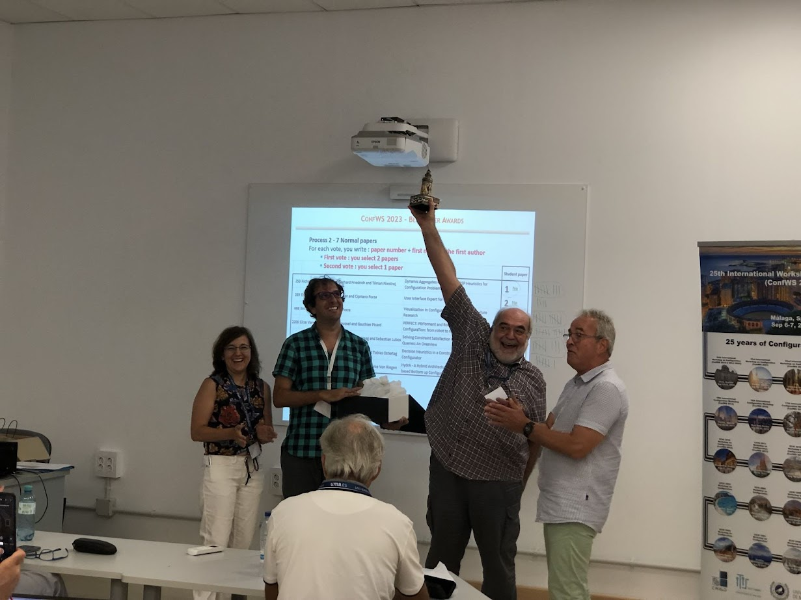
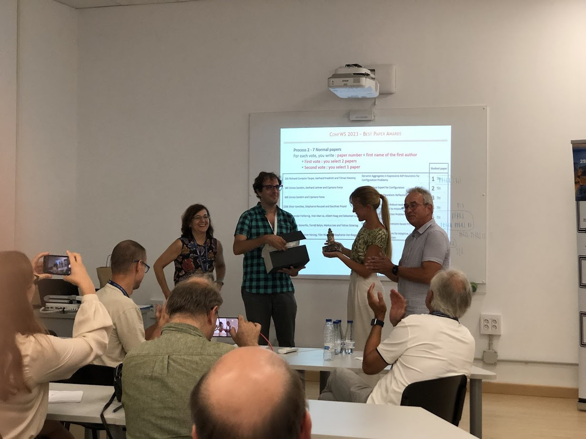

<!--
**Under configuration...**

 The ConfWS 2023 introduced the figure of *Award Chair* in the organization committee, a role played by Michel Aldanondo (Université de Toulouse, France), who was in charge of managing the selection of the best paper awards in a two-phase audience vote at the end of the workshop. This forum presents awards to the best papers since ConfWS 2015.
 -->

This year, in ConfWS 2025, the Best Paper Award winner were:

- **Best Paper Award**: _Generative Design as a Configuration Problem_ by Jonathan Raines, David Barton and Ben Hicks.
- **Best Student Paper Award**: *From 4GL Spreadsheet Computations to Constraint Model Definitions – A Development Process* by Boi Schaefer and Lothar Hotz.

<!--

-->