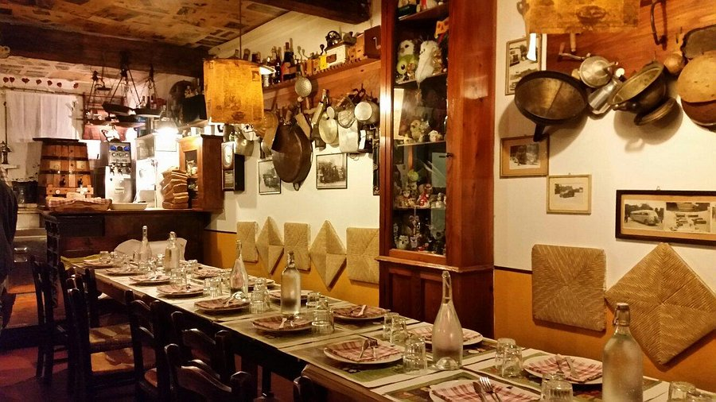

<!-- **The papers of ConfWS'2025 can be downloaded [here](../assets/confws/papers.zip). They will be also available online in CEUR-WS.org after the workshop.** -->
**The papers of ConfWS’2026 will be downloadable here. They will be also available online in CEUR-WS.org after the workshop.**

<!--
*There will be an "informal" self-organized meeting/dinner on Tuesday afternoon for those that arrive on Tuesday. For those interested, here are some places we recommend for the meeting (all of them are in Málaga downtown next to the Cathedral): [El Pimpi](https://goo.gl/maps/JiYcUhMmUfqGqxUaA), [Casa Lola](https://goo.gl/maps/tzKWhdu82wrNe1o4A), [Las Merchanas](https://goo.gl/maps/2paBoGtEJ7VCU8Qk7).*

-->

<!-- **Venue:** Room 1.4, Engineering School, University of Bologna
 Viale del Risorgimento, 2, Bologna
 
All times are in the Central European Time CET (UTC +1)

 
Author / Presenter Information: 
<b>Keynotes:</b> 30 min for presentation + 10 min for questions 
<b>Papers:</b> 15 min for presentation + 5 min for questions

 -->

**Registration Desk Hours:**
 
**TBD**
<!-- University of Bologna, Engineering School: Oct 25 (07:45–18:00), Oct 26 (07:45–14:00) -->

|                    | *Saturday, 15th August 2026* |
| ------------------ |----------------------------------------------------|
| 09:00 - 09:15  | Welcome  |
| 09:15 - 10:00  | Keynote, incl. discussion  |
|   | &nbsp;&nbsp;&nbsp;*-- Session 1: Usability --* **Chair:  TBA**   |
| 10:00 - 10:30      | Sebastian Lubos, Alexander Felfernig, Viet-Man Le, Thi Ngoc Trang Tran, Doris Suppan, Reinhard Willfort, Ivan Dukic, Jeremias Fuchs and Manuel Henrich. **Enabling Automated Usability Evaluation for Configurator User Interfaces** _25 min + 5 Q&A_ |
| 10:30 - 11:00 | *Coffee break* |
|   | &nbsp;&nbsp;&nbsp;*-- Session 2: AI and Configuration --* **Chair: TBA**  |
| 11:00 - 11:30     | Konstantin Herud and Joachim Baumeister. **Position Paper: Use Cases for Generative AI in Product Configuration** _25 min + 5 Q&A_ |
| 11:30 - 12:00     | Veronika Semmelrock, Benedetta Strizzolo, Francesco Zuccato, Gerhard Friedrich, Patrick Rodler and Konstantin Schekotihin. **Learning to Solve and Optimize by Evolving Code** _25 min + 5 Q&A_ |
| 12:00 - 12:30     | Viet-Man Le, Sebastian Lubos, Thi Ngoc Trang Tran and Alexander Felfernig. **Cognitive Robustness of Large Language Models in Configuration Knowledge Engineering** _25 min + 5 Q&A_ |
| 12:30 - 14:00 | *Lunch break* |
|  | &nbsp;&nbsp;&nbsp;*-- Session 3: Usability --* **Chair: TBA**  |
| 14:00 - 14:30     | Qingsong Zhao, Oliver Bleisinger, Lars Hvam and Lars Lundberg Kristensen. **Explaining Product Configurator Usage in Engineering companies: A Technology Acceptance Perspective** _25 min + 5 Q&A_ |
| 14:30 - 15:00  | Walk to venue NEOS, Konrad Zuse Str 8 for **Industrial break out**  |
| 15:00 - 15:20  | **Keynote**: Frank Dylla, Cordes 6 Graefe KG, Thorsten Krebs, encoway GmbH |
| 15:20 - 16:20  | *Break* |
| 16:20 - 16:40  | **Industrial Use Cases**: Christoph Zengler, BooleWorks GmbH, Maximilian Heisiinger, Optoifkonf FlexCo, Martin Ring, DOCK.ONE |
| 16:40 - 17:25  | **Panel discussion**: Current research directions—and what industry truly needs |
| 17:25 - 17:45  | Lessons learned / Closing |
|  | *End of first day* |  
| 19:00 | *Workshop Dinner* |

|                    | *Sunday, 16th August, 2026* |
| ------------------ |----------------------------------------------------|
| | &nbsp;&nbsp;&nbsp;*-- Session 4: Applications and Case Study --* **Chair:  TBA**  |
| 09:00 - 09:30      | 	Franz Wotawa. **An extended experimental evaluation of an answer set programming solution to the task assignment problem** _25 min + 5 Q&A_ |
| 09:30 - 10:00     | 	Joachim Baumeister, Konstantin Herud, Jan Heuer, Jochen Reutelshöfer, Nicolas Rühling, Abdallah Saffidine and Torsten Schaub. **The ShadowMaster Problem: A Real-World Case Study in Product Configuration** _25 min + 5 Q&A_ |
| 10:00 - 10:30    | Kateryna Czerniachowska. **Broken Retail States as Configurable Objects in Retail Shelf Systems** _25 min + 5 Q&A_ |
| 10:30 - 11:00 | *Coffee break* |
| | &nbsp;&nbsp;&nbsp;*-- Session 5: Models --* **Chair:  TBA**  |
| 11:00 - 11:30    | Alessio Trentin, Enrico Sandrin, Svetlana Suzic, Chiara Grosso and Cipriano Forza. **Reconciling Product Flexibility with Cost, Delivery, and Quality: The Importance of Bundling Online Sales Configurator, Product Modularity and Knowledge Absorption from Customers** _25 min + 5 Q&A_ |
| 11:30 - 12:00    | Carsten Sinz. **Authoring Automotive Configurations with Internal DSLs** _25 min + 5 Q&A_ |
| 12:00 - 13:00  | Reward & Next year's workshop  |
| 13:00 - 14:00 | *Lunch break* |
|  | *End of second day* |

## Social Dinner
**TBD**

- Saturday 25th Oct. 19:30h @ [Osteria Al 15](https://www.facebook.com/profile.php?id=100063486165553)
  
The social dinner of ConfWS'25 will take placed at **[Osteria Al 15](https://www.google.com/maps/place/Osteria+Al+15/@44.4873483,11.3410971,825m/data=!3m2!1e3!4b1!4m6!3m5!1s0x477fd4c1e679805d:0xbd4faa3163eef269!8m2!3d44.4873483!4d11.3410971!16s%2Fg%2F1tv3mjl7?entry=ttu&g_ep=EgoyMDI1MTAxNC4wIKXMDSoASAFQAw%3D%3D)**, an intimate, wood-beamed trattoria serving traditional Bolognese pasta and gnocchi, located in the heart of the city.



